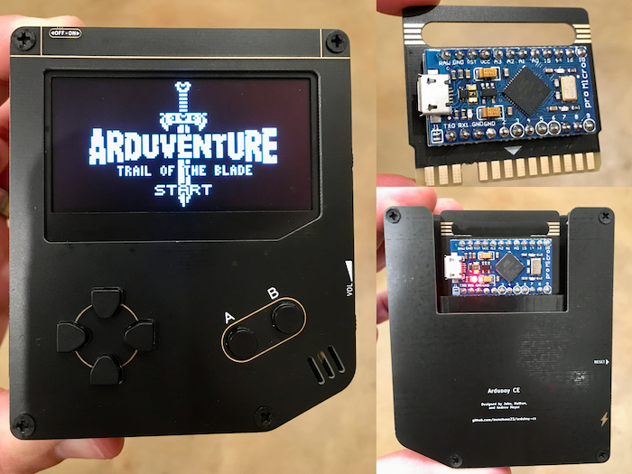
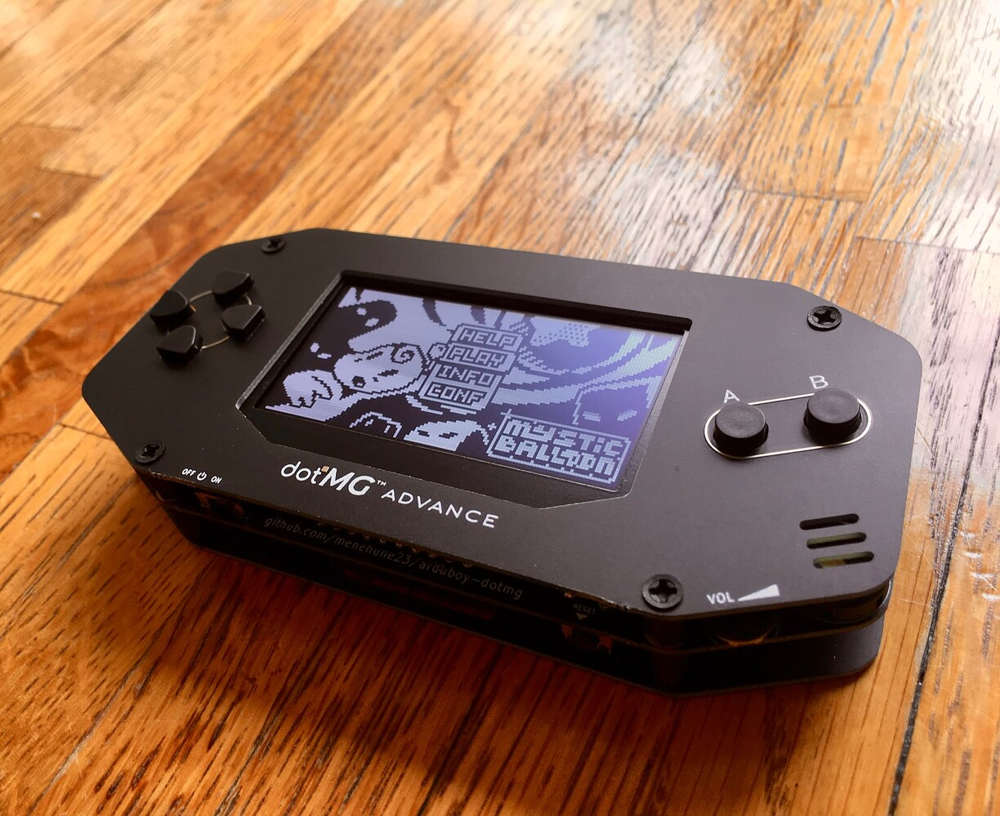
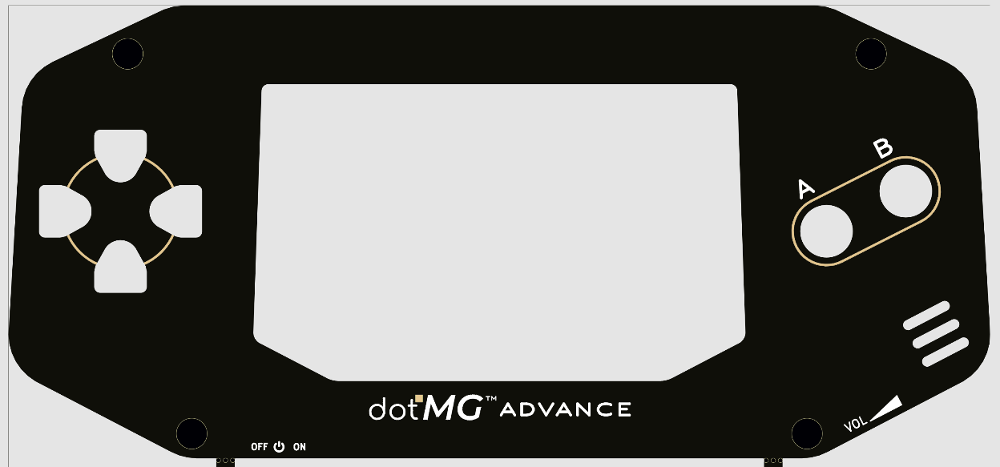

<p align="center"></p>

**dotMG** is an

```// Arduboy-compatible```

```// cartridge-based```

```// hackable```

DIY game console!

<p align="center">
   
   
</p>
<p align="center">
   
   
</p>

> More pictures in the [assets](assets) folder!

Designed to remind you of the early days of handheld gaming, dotMG combines game cartridges with Arduboy greatness!

## Features

- Swappable game cartridges based on the Arduino Pro Micro (including reverse cart protection)

- Extensibility via EXT header (exposes SPI/I2C/GPIO pins) -- add your own crank, accelerometer, joystick, flash chip, RGB LED, or any other add-on of your own creation!

- Rechargeable battery (with play 'n charge capability via load-sharing circuitry)

- Analog volume control

- Large 2.44" 128x64 high-contrast OLED display

## Documentation

Select one of the following to learn how to build and use dotMG

- [Build Guide](docs/build.md)
- [Usage Guide](docs/usage.md)
- [PCB Ordering Guide](docs/pcb-ordering.md)
- [Custom Shell Guide](docs/custom-shell.md)

## Reporting Issues

If you've found a hardware/software bug, have feedback, or if you just need help troubleshooting, please [file an issue](https://github.com/menehune23/arduboy-dotmg/issues). I'm just one person, so I'll try to respond as best as I can (bugs will take priority over feedback and troubleshooting).

## License

Copyright (c) 2021 Andrew Meyer.

[Attribution-NonCommercial-ShareAlike 4.0 International (CC BY-NC-SA 4.0)](https://creativecommons.org/licenses/by-nc-sa/4.0/)

This project is for DIYers and hobbyists. It may not be used for anything considered commercial use without the author's explicit, written consent. Otherwise, use at your own risk and have fun!

**This project is not officially licensed or endorsed by [Arduboy](https://arduboy.com).**
