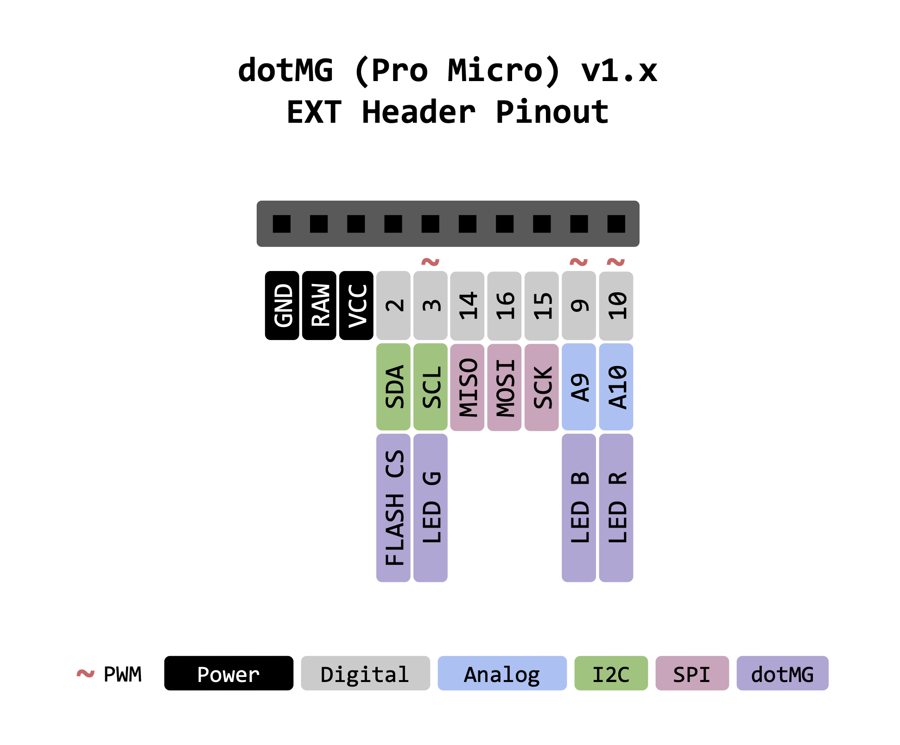
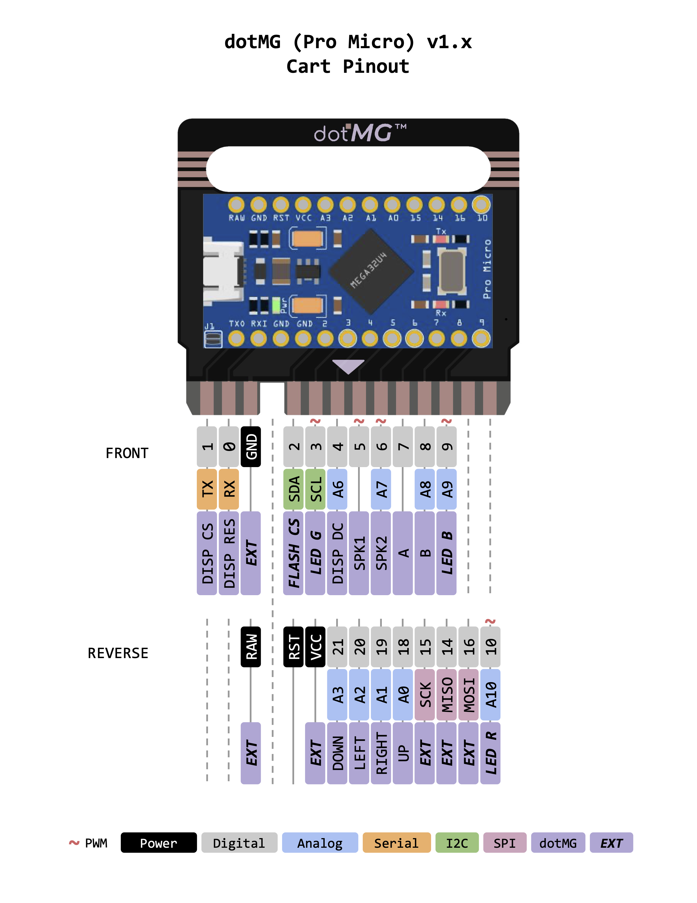

# dotMG Usage Guide

## IDE Setup

If you've already [built your own dotMG](build.md), you can program game cartridges using the Arduino IDE and the custom board package found in this repo. To get going, follow these steps:

1. Add `https://raw.githubusercontent.com/menehune23/arduboy-dotmg/main/board-packages/package_dotmg_index.json` to board manager URLs in the Arduino IDE (found in settings)

1. Open the board manager from the Arduino IDE `Tools` menu, then search for "dotMG" and install

1. Connect the game cartridge to your computer using a micro-USB cable, then select the `dotMG (Pro Micro)` board from the `Tools` menu

    > If your game cartridge is still plugged into the console, be sure to connect to the game cartridge's USB port, **not** the port on the console. It is OK and expected that the console will turn on in this case, regardless of the power switch position (because power is coming through the cartridge directly).

1. If a USB port was not selected for you in the IDE, select one

## Uploading Games & Programs

1. [Select an Arduino sketch to upload](#games) and open it in the Arduino IDE

1. Adjust compilation options via the `Tools` menu, if needed (e.g. to [use an RGB LED](#rgb-led))

1. Click the upload button in the IDE to compile and upload!

> **IMPORTANT:** The dotMG board package already contains its own versions of Arduboy libraries (`Arduboy`, `Arduboy2`, `ArduboyTones`, `ATMlib`, etc.). To avoid confusing compiler errors, you must **uninstall these libraries** if you've previously installed them. (To program an official Arduboy, you'll need to reinstall them or use the [Homemade Arduboy Package](https://github.com/MrBlinky/Arduboy-homemade-package) and select a standard Arduboy from that package's board menu.)

## Game Resources

### Homemade Games

If you want to learn to program your own games for dotMG using the Arduboy libraries, [here's a good place to start](https://community.arduboy.com/t/make-your-own-arduboy-game-part-2-printing-text). Some searches on Google or YouTube for "Arduboy programming tutorial" will also likely yield helpful results.

The dotMG board package defines the following macros automatically (usable with compiler directives like `#ifdef` or `#ifndef`), for use when programming your own games:

- `DAB_DOTMG_PRO_MICRO`: If defined, signifies that a dotMG Pro Micro cartrige is running the code

-  `DAB_DOTMG_PRO_MICRO__NO_RGBLED`: If defined, signifies that `Has RBG LEDs` was selected in the Arduino IDE `Tools` menu (signifies `No RGB LEDs` if not defined)

### Pre-made Games

If you want to find pre-made games, here are some resources for game sketches:

- [Team ARG Museum](https://team-arg-museum.github.io)
- [Erwin's Arduboy Collection](https://arduboy.ried.cl)

> **Note:** If you come across `.hex` files, they're likely compiled for the original Arduboy and are not natively compatible with dotMG. For best results, locate the game's source code, then upload using the steps given above.

## Extending dotMG

Ready to hack dotMG and have some real fun? You can use the built-in EXT header to add your own sensors, an [RGB LED](#rgb-led), or even a [flash chip](#flash-chip).

Use the following pinouts and wiring diagrams as references.

### Pinouts

(Click to enlarge)

### Wiring Diagrams

- [System wiring diagram](/hardware/system/schematic.pdf)
- [Cartrige wiring diagram](/hardware/cart/schematic.pdf)

### RGB LED

Some Arduboy games (or games of your own making) make use of an RGB LED. If you want to add one to your dotMG, be sure to:

- Use a [**common anode** RGB LED](https://www.hackster.io/techmirtz/using-common-cathode-and-common-anode-rgb-led-with-arduino-7f3aa9) (or an equivalent configuration of individual LEDs)
- Use the pins noted in the above pinout
- Don't forget to add resistors!
- Select `Has RBG LEDs` from the Arduino IDE `Tools` menu before uploading your sketch (if using Arduboy libraries)

Wiring up an RGB LED is optional. If you choose to use those pins for something else instead, simply select `No RBG LEDs` from the Arduino IDE `Tools` menu. This will optimize the code in the Arduboy library so that it doesn't attempt to use those pins.

> If you're not using an Arduboy library, you can still [check the RGB menu setting in code](#no-rgb).

### Flash Chip

Flash chips can store hundreds of games at once. Adding a flash chip to dotMG is an advanced topic and is not fully documented here (but [here's a good start](https://community.arduboy.com/t/flash-cart-ridge)). In general, it involves:

- Wiring a flash chip using the above pinout
- Installing the Cathy3K bootloader onto your game cartridge
- Compiling games to `.hex` files and uploading them to the flash chip
